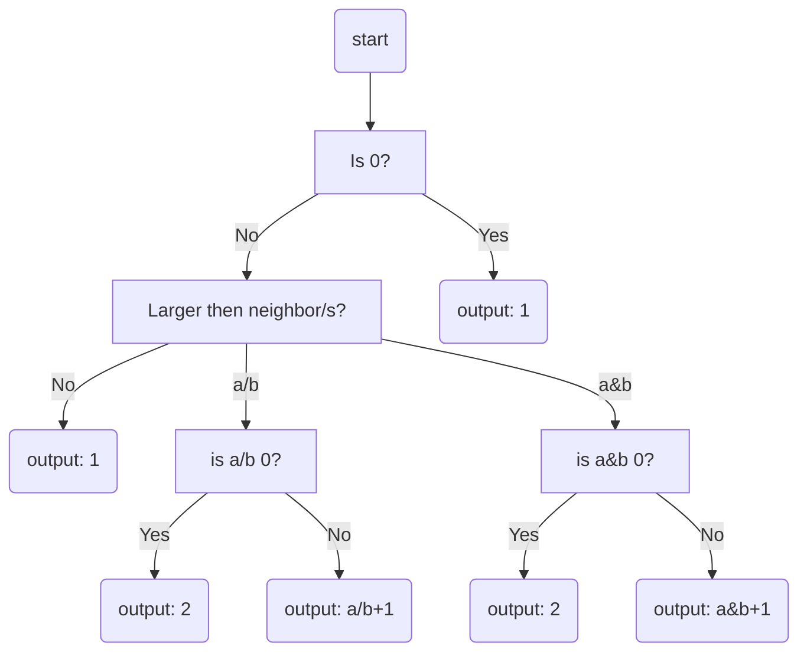

### Strat 2: edit in place

### Strat 3: Layered filter increase strat

[1, 3, 7, 8, 7]
 |  |  |  |  |
 v  v  v  v  v
 1  1  1  1  1 #base
    |  |  |  
    v  v  v
	2  2  2    #has lower neighbor with same number
	   |  |  
       v  v
	   3  3    #has lower neighbor with same number
		  | 
          v
	      4    #has lower neighbor with same number

 1  2  3  4  1 #final
