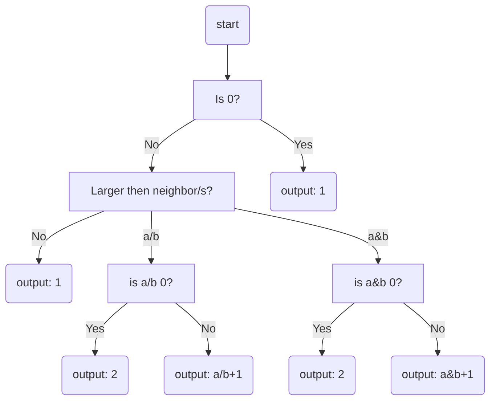

```mermaid
flowchart TD
s(start) --> A[Is 0?]
A -- No --> B[Larger then neighbor/s?]
B -- No --> J(output: 1)
A -- Yes --> C(output: 1)
B -- a/b --> D[is a/b 0?]
D -- Yes --> F(output: 2)
D -- No --> G(output: a/b+1)
B -- a&b --> E[is a&b 0?]
E -- Yes --> H(output: 2)
E -- No --> I(output: a&b+1)
```
